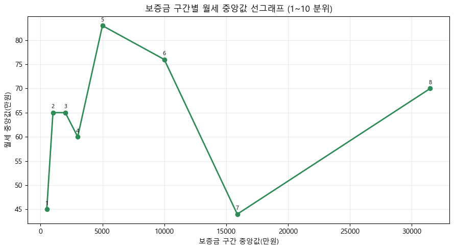
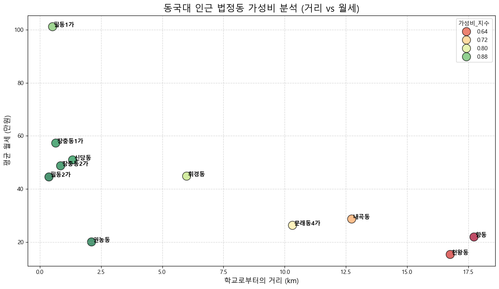

# 🏠 거리·면적·월세 기반 대학생 자취 지역 추천 분석
> **단순 월세를 넘어, 거리와 면적 효율성까지 고려한 대학생 맞춤형 주거지 추천 모델**

## 1. 프로젝트 배경 및 목적

* **동국대 재학생 주거 문제 해결:** 학교 인근(중구, 성북구 등)의 높은 주거비 부담을 완화하기 위한 객관적 지표가 필요함.
* **통합 가성비 지수 산출:** 학교와의 거리 기반 접근성과 주거 쾌적성(면적)을 월세 데이터와 결합하여 상대적으로 효율적인 주거 지역을 제안함.

## 2. 분석 환경 및 데이터

- 데이터:
  - 2025년 서울특별시 전월세 실거래가 공공데이터 (Open Data)

- 기술 스택:
  - `Python`
  - `Pandas`
  - `Matplotlib`
  - `Seaborn`
  - `Scikit-learn`
  - `Haversine Formula`

## 3. 핵심 분석 내용

* **거리 계산:** 동국대학교 본관 좌표를 기준으로 각 법정동의 중심지까지의 물리적 거리 산출.
* **면적 효율성:** '임대료 / 임대면적' 계산을 통해 1㎡당 실질 비용인 **'면적당 임대료'** 파생 변수 생성.
* **통합 지수 모델링:** 거리, 면적당 임대료, 월세 데이터를 각각 정규화한 후, 가중합(Weighted Sum) 방식으로 통합 가성비 지수를 산출함.
## 4. 주요 분석 결과 (TOP 5)

| 순위 | 법정동명 | 가성비 지수 | 특이사항 |
|:---:|:---|:---:|:---|
| 1 | **필동2가** | 0.9529 | 초근접성 (0.37km) 및 합리적 월세 |
| 2 | **권농동** | 0.9480 | 압도적인 면적 효율성 (공간 선호형 추천) |
| 3 | **장충동2가** | 0.9359 | 우수한 접근성 및 주거 인프라 |
| 4 | **장충동1가** | 0.9282 | 위치 프리미엄이 반영된 주거지 |
| 5 | **신당동** | 0.9214 | 다양한 매물 선택권 및 교통 요지 |

### 시각화 결과

## 5. 결론 및 기대효과

- 단순 월세 비교에서 벗어나 '거리 대비 가치'와 '공간 대비 가치'를 동시에 고려한 의사결정 가능
- 보증금 수준별 맞춤 추천 로직을 통해 데이터 기반으로 개인별 경제 상황에 맞는 상대적으로 효율적인 주거 지역을 도출함

### 주요 인사이트

- 학교와의 거리만 가까운 지역이 반드시 높은 가성비를 보이지는 않았음
- 일부 지역은 월세 수준은 높지만 면적 효율성이 우수해 높은 종합 점수를 기록함
- 신당동은 다양한 매물 분포로 인해 안정적인 평균 가성비를 보였음

## 6. 한계점 및 개선 방향

- 실제 이동시간이 아닌 직선거리 기반 분석 수행
- 치안, 교통, 생활 인프라 요소 미반영
- 법정동 평균값 사용으로 개별 매물 특성 반영 한계 존재
- 향후 API 기반 실시간 매물 데이터 연동 가능
